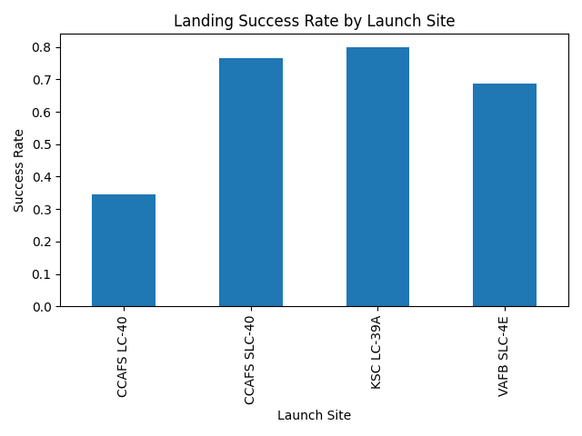

<<<<<<< HEAD
# SpaceX Falcon 9 Landing Success Prediction

This project analyzes SpaceX Falcon 9 launch data to understand what factors influence the successful landing of the first stage booster.

The workflow includes data cleaning, exploratory analysis, visualization, and machine learning models to predict landing success.

---

# Project Goal

The objective of this project is to predict whether the Falcon 9 booster will land successfully after launch.

Successful booster recovery significantly reduces launch costs and is a key innovation of SpaceX.

---

# Dataset

The dataset contains information about Falcon 9 launches, including:

- Launch date
- Booster version
- Launch site
- Payload mass
- Orbit
- Customer
- Mission outcome
- Landing outcome

Total launches analyzed:

**101 launches**

---

# Project Structure

Ds-capstone-spacex-falcon9-main

data/
Spacex.csv
spacex_cleaned.csv
model_scores.csv

src/
spacex_portfolio_pipeline.py

notebooks/
(original analysis notebooks)

README.md
requirements.txt

---

# Workflow

The project follows a typical data science pipeline:

1. Load data
2. Clean dataset
3. Create target variable
4. Analyze dataset
5. Visualize data
6. Train machine learning models
7. Save results

---

# Exploratory Analysis

Example insights discovered during analysis:

- Overall landing success rate: **~65%**
- Launch site affects landing success
- Payload mass impacts landing probability
- Different Falcon 9 booster generations have different performance

---

# Machine Learning Models

The following models were trained:

| Model | Description |
|------|------|
| Logistic Regression | Linear model estimating landing probability |
| Decision Tree | Rule-based model using branching decisions |
| Random Forest | Ensemble of multiple decision trees |

The models were trained using features such as:

- Payload mass
- Orbit
- Launch site
- Booster generation
- Launch year

---

# Results

Example model performance:

| Model | Accuracy |
|------|------|
| Logistic Regression | ~0.70 |
| Decision Tree | ~0.73 |
| Random Forest | ~0.76 |

The **Random Forest model performed best** on the test dataset.

---

## Visualization

Landing success rate by launch site:

Includes simple visual analysis such as:

- Landing success rate by launch site
- Payload mass distribution
- Success rate by orbit

---

# How to Run the Project

Install dependencies:

pip install -r requirements.txt

Run the pipeline:

python src/spacex_portfolio_pipeline.py

This will:

- clean the dataset
- run the analysis
- train models
- save results

Outputs are stored in:

data/spacex_cleaned.csv
data/model_scores.csv

---

# Technologies Used

- Python
- Pandas
- Scikit-learn
- Matplotlib
- Jupyter Notebook

---

# Author

Facundo Contreras
=======
# SpaceX Falcon-9 Success Landing Prediction
### _Predict if SpaceX Falcon 9 first stage will land successfully after rocket launch_.

In this capstone, we will predict if the Falcon 9 first stage will land successfully. SpaceX advertises Falcon 9 rocket launches on its website, with a cost of 62 million dollars; other providers cost upward of 165 million dollars each, much of the savings is because SpaceX can reuse the first stage. Therefore if we can determine if the first stage will land, we can determine the cost of a launch. This information can be used if an alternate company wants to bid against SpaceX for a rocket launch.

### Data collection with Webscraping and Data wrangling
#### _Objectives_
Write Python code to manipulate data in a Pandas data frame.

Convert a JSON file into a Create a Python Pandas data frame by converting a JSON file

Create a Jupyter notebook and make it sharable using GitHub

Use data science methodologies to define and formulate a real-world business problem.

Use your data analysis tools to load a dataset, clean it, and find out interesting insights from it.

### Exploratory Data Analysis (EDA)
Make use a RESTful API  and web scraping. Convert the data into a dataframe and then perform some data wrangling.
#### _Objectives_
Create scatter plots and bar charts by writing Python code to analyze data in a Pandas data frame

Write Python code to conduct exploratory data analysis by manipulating data in a Pandas data frame

Write and execute SQL queries to select and sort data

Use your data visualization skills to visualize the data and extract meaningful patterns to guide the modeling process.

### Interactive Visual Analytics and Dashboards
Build a dashboard to analyze launch records interactively with Plotly Dash as well as build an interactive map to analyze the launch site proximity with Folium python Library.
#### _Objectives_
Build an interactive dashboard that contains pie charts and scatter plots to analyze data with the Plotly Dash Python library

Calculate distances on an interactive map by writing Python code using the Folium library

Generate interactive maps, plot coordinates, and mark clusters by writing Python code using the Folium library

Build a dashboard to analyze launch records interactively with Plotly Dash.

Build an interactive map to analyze the launch site proximity with Folium.

### Predictive Analysis(Classification)
In this module, we'll use machine learning to determine if the first stage of Falcon 9 will land successfully. Data will be split into training data and test data to find the best Hyperparameter for SVM, Classification Trees, and Logistic Regression. Then find the method that performs best using test data.
#### _Objectives_
Split the data into training testing data.

Train different classification models.

Hyperparameter grid search.

Use your machine learning skills to build a predictive model to help a business function more efficiently.
>>>>>>> 8df522193bf76114e83b95c17bf41263aec76232
